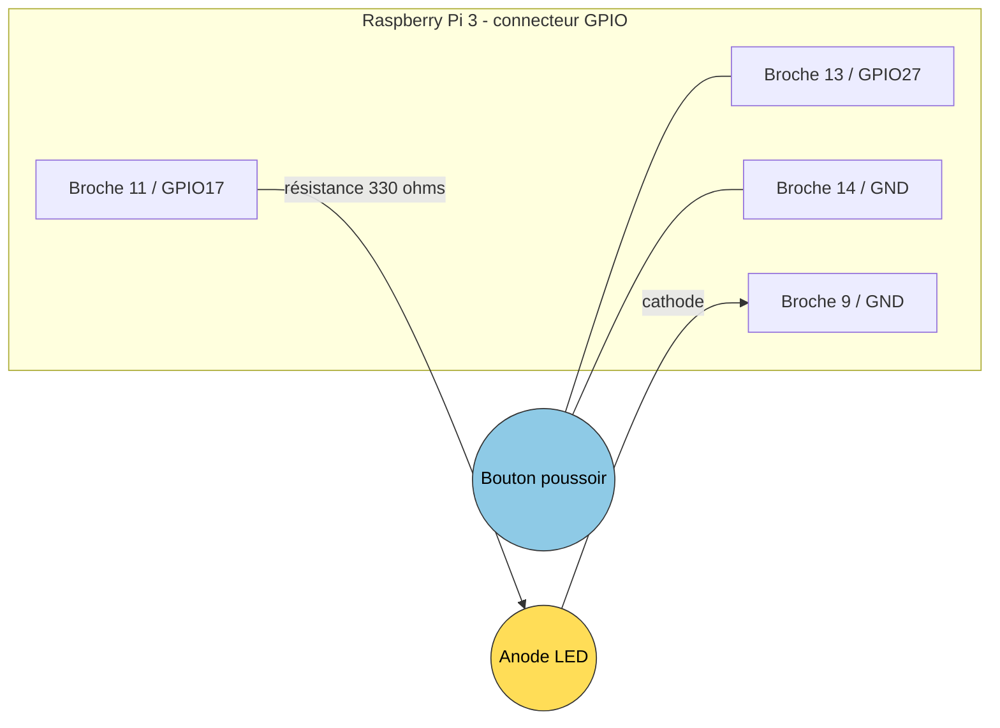
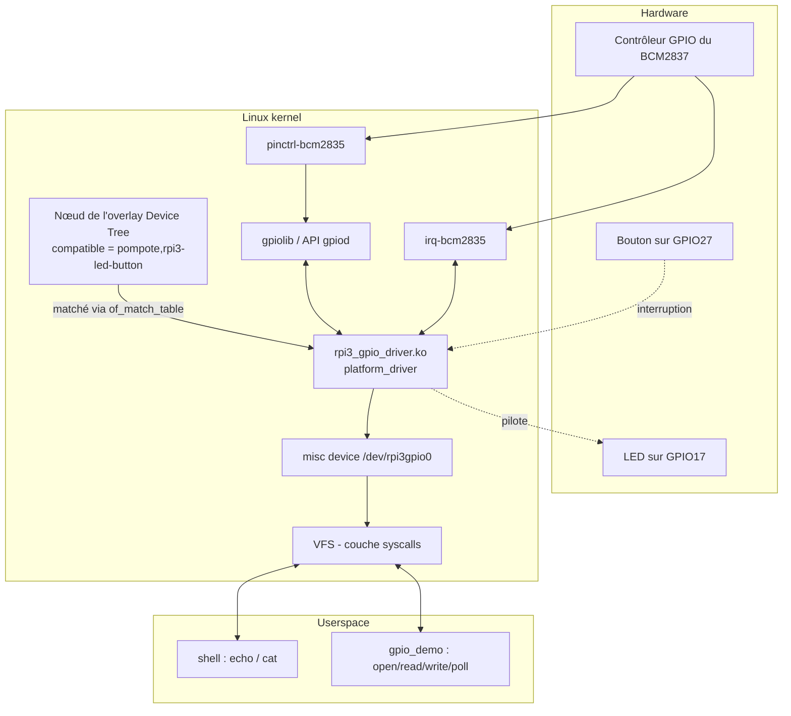
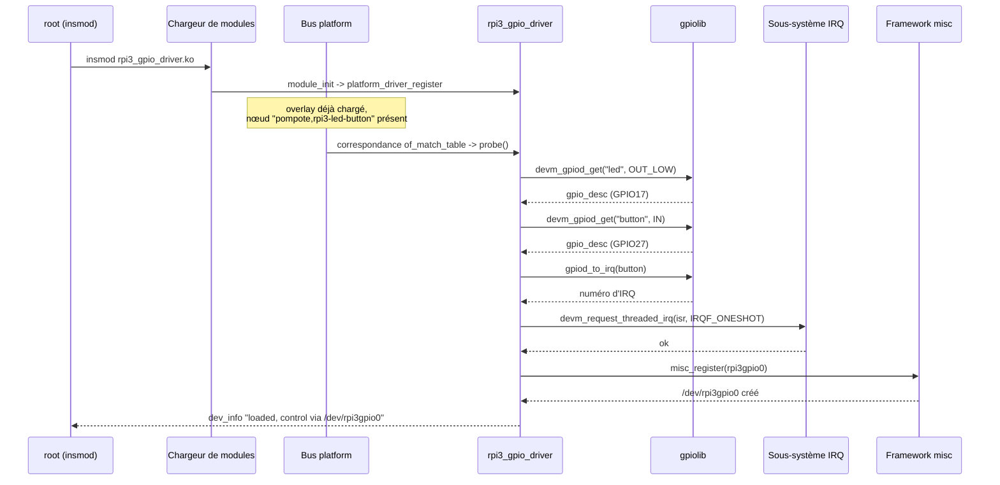
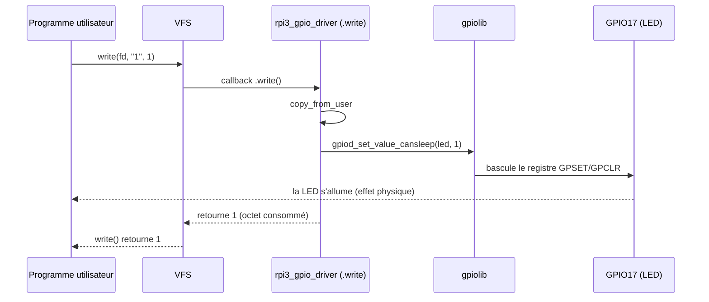
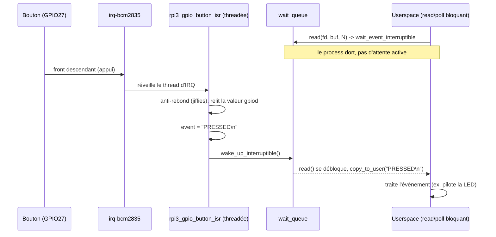
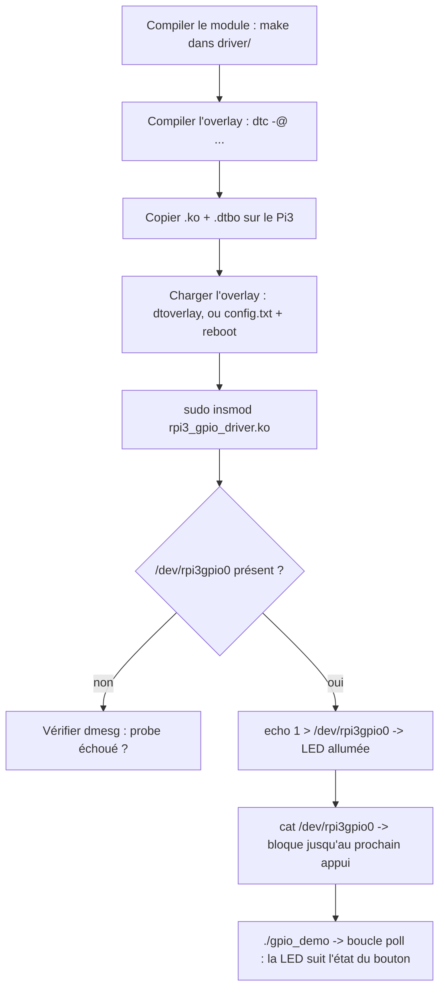

# rpi3-gpio-driver

Un petit driver Linux pour piloter une LED et un bouton poussoir sur un
Raspberry Pi 3, avec un overlay Device Tree pour le lier au hardware et
un programme de démonstration en userspace. Écrit comme pièce
de portfolio pour démontrer le modèle de driver Linux moderne : platform
driver + Device Tree + API descripteurs `gpiod` + interruption threadée
+ character device pour le userspace.

## Arborescence du repo

```
rpi3-gpio-driver/
├── driver/
│   ├── rpi3_gpio_driver.c   # platform driver (kernel module)
│   └── Makefile             # Makefile kbuild hors-arbre
├── dts/
│   └── rpi3-gpio-led-button-overlay.dts   # overlay Device Tree
└── userspace/
    └── gpio_demo.c          # exemple de client (poll/read/write)
```

## Câblage hardware

GPIO17 (broche physique 11) pilote la LED, GPIO27 (broche physique 13)
lit le bouton. Le bouton s'appuie sur le pull-up interne du SoC
(configuré dans l'overlay Device Tree, voir plus bas) : au repos la
ligne est haute, un appui la tire à la masse.



**Pourquoi GPIO17 et GPIO27 précisément** : ce sont des broches
génériques, sans fonction alternative câblée en dur ailleurs sur le
connecteur (contrairement à GPIO0/1 réservées à l'EEPROM d'identification
des HAT, GPIO2/3 à l'I2C1, GPIO7-11 au SPI0, GPIO14/15 à l'UART0,
GPIO18-21 au PCM/I2S). N'importe quelle autre paire de GPIO libres aurait
fonctionné de façon électriquement identique. Ce choix est une pure
convention, reprise de la quasi-totalité des tutoriels RPi LED+bouton,
pas une contrainte hardware. L'intérêt concret est surtout d'éviter
tout conflit si on active un jour I2C/SPI/UART sur la même carte.

## Architecture logicielle

L'overlay ajoute un nœud (`compatible = "pompote,rpi3-led-button"`) que
le platform driver reconnaît. Une fois lié, `gpiod` fournit au driver
deux descripteurs GPIO ; celui du bouton est en plus mappé sur une IRQ.
Le userspace ne dialogue avec le driver qu'au travers de
`/dev/rpi3gpio0`.

Le contrôleur GPIO n'est pas une puce séparée (pas de type expandeur
I2C externe) : il fait partie intégrante du SoC BCM2837 lui-même, au
même titre que les cœurs ARM et le GPU VideoCore. Chaque broche
physique est multiplexable via pinmux entre plusieurs fonctions (GPIO
générique, I2C, SPI, UART, PWM...). C'est un peu comme un south-bridge
PC qui centralise les entrées/sorties bas débit, mais c'est intégré sur
la même puce, pas en silicium à part.



### Chargement du module / probe



### Piloter la LED depuis le userspace (chemin d'écriture)



### Interruption bouton / chemin de lecture



## Compilation

Deux artefacts indépendants à compiler : le kernel module et l'overlay
Device Tree.

### Kernel module

```sh
cd driver
# Build natif, exécuté directement sur le Pi (nécessite raspberrypi-kernel-headers) :
make ARCH= CROSS_COMPILE=

# Cross-compilation sous WSL2 contre une arborescence raspberrypi/linux
# configurée et compilée, correspondant au kernel réellement lancé sur la cible :
make KDIR=/chemin/vers/raspberrypi/linux
```

Ceci produit `rpi3_gpio_driver.ko`.

### Overlay Device Tree

```sh
cd dts
dtc -@ -I dts -O dtb -o rpi3-gpio-led-button.dtbo rpi3-gpio-led-button-overlay.dts
```

`-@` conserve les informations de phandle/symbole de l'overlay,
nécessaires pour qu'un overlay `/plugin/` soit résolvable au chargement.

## Déploiement sur le Pi

1. Copier `rpi3_gpio_driver.ko` et `rpi3-gpio-led-button.dtbo` sur le Pi.
2. Charger l'overlay, de façon persistante ou pour un test ponctuel :

   ```sh
   # Persistant (survit au reboot) : copier le .dtbo, puis le référencer
   sudo cp rpi3-gpio-led-button.dtbo /boot/overlays/
   echo "dtoverlay=rpi3-gpio-led-button" | sudo tee -a /boot/config.txt
   sudo reboot

   # OU dynamique, sans reboot (nécessite que le .dtbo soit déjà dans /boot/overlays/) :
   sudo dtoverlay rpi3-gpio-led-button
   ```

3. Charger le module :

   ```sh
   sudo insmod rpi3_gpio_driver.ko
   dmesg | tail        # confirme que le probe a réussi, /dev/rpi3gpio0 créé
   ```

## Piloter depuis le userspace



Une fois `/dev/rpi3gpio0` présent :

```sh
# Allumer / éteindre la LED
echo 1 | sudo tee /dev/rpi3gpio0
echo 0 | sudo tee /dev/rpi3gpio0

# Bloque jusqu'au prochain appui/relâchement du bouton, l'affiche, puis quitte
sudo cat /dev/rpi3gpio0
```

Ou lancer le programme de démo, qui utilise `poll()` pour réagir aux
évènements du bouton sans attente active, et fait suivre l'état du
bouton sur la LED :

```sh
gcc -o gpio_demo userspace/gpio_demo.c
sudo ./gpio_demo
```

## Dépannage

- **`/dev/rpi3gpio0` absent** : `dmesg | grep rpi3-gpio-driver`. Le plus
  probable est que l'overlay n'est pas chargé (aucun nœud DT
  correspondant, donc `probe()` ne s'exécute jamais) ou que
  `devm_gpiod_get()` a échoué (vérifier que les noms de propriétés
  `led-gpios` / `button-gpios` de l'overlay correspondent à ce que le
  driver demande).
- **Permission refusée sur `/dev/rpi3gpio0`** : les misc devices sont
  root-only par défaut sauf règle udev spécifique ; utiliser `sudo` ou
  ajouter une règle.
- **Le bouton ne déclenche jamais rien** : vérifier le câblage par
  rapport au [schéma de câblage](#câblage-hardware), et que
  `button_pins` dans l'overlay active bien le pull-up
  (`brcm,pull = <2>`). Sans ça, l'entrée flotte et les interruptions se
  déclenchent aléatoirement.

## Licence

GPL-2.0-only (kernel module et overlay Device Tree) ; la démo en
userspace est fournie sous la même licence par cohérence.

